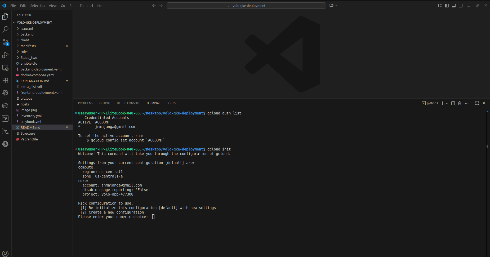
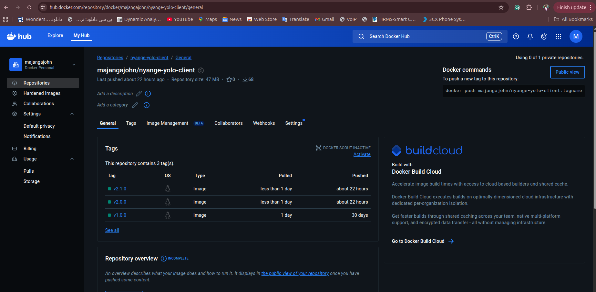
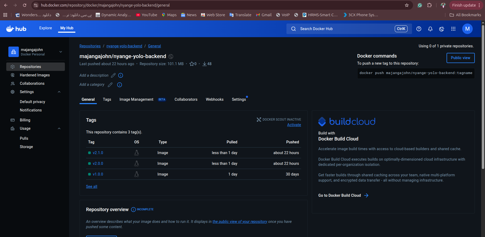
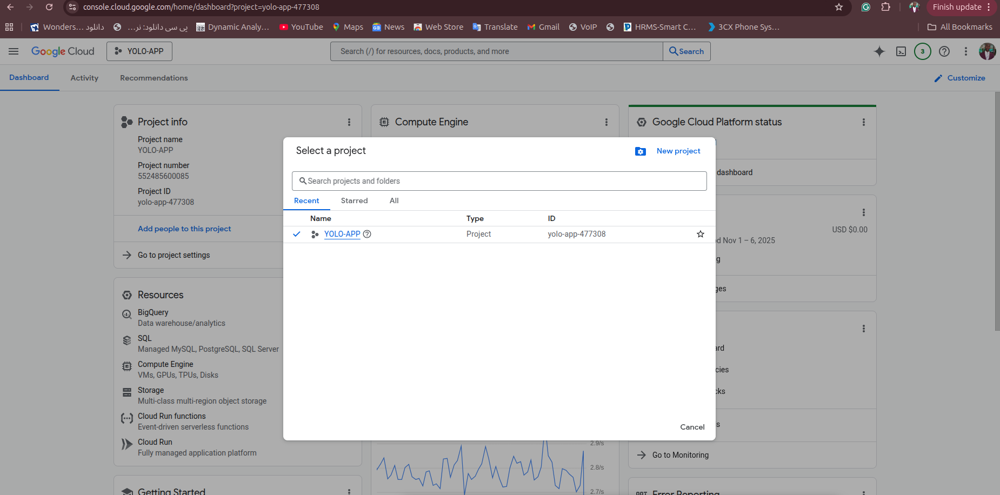
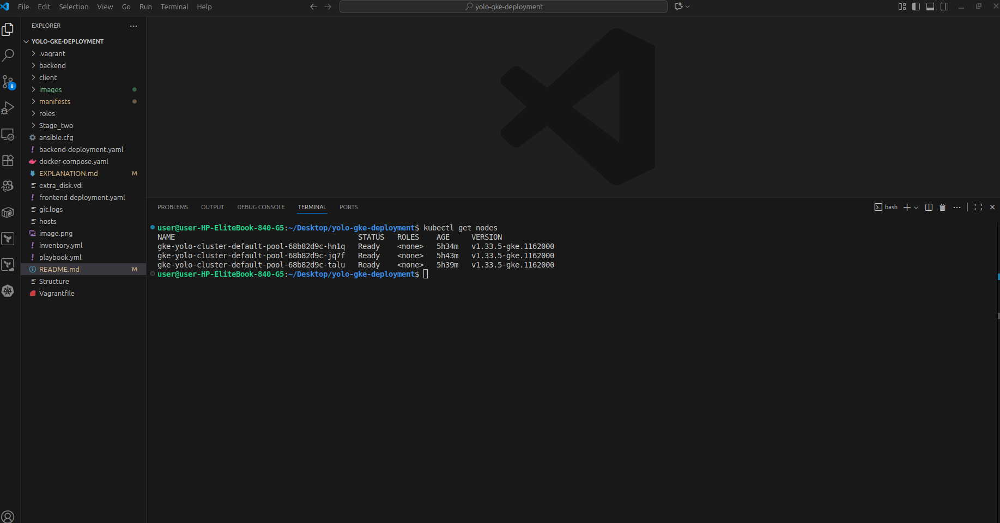
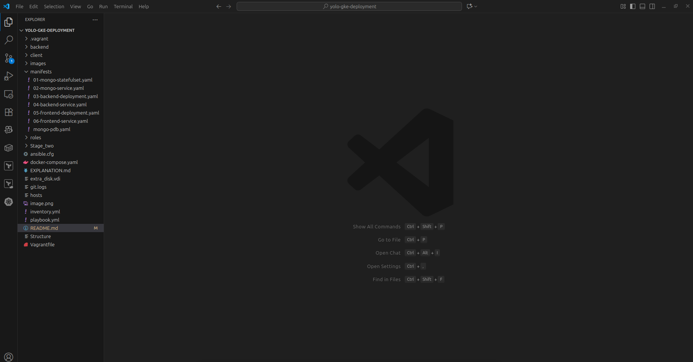
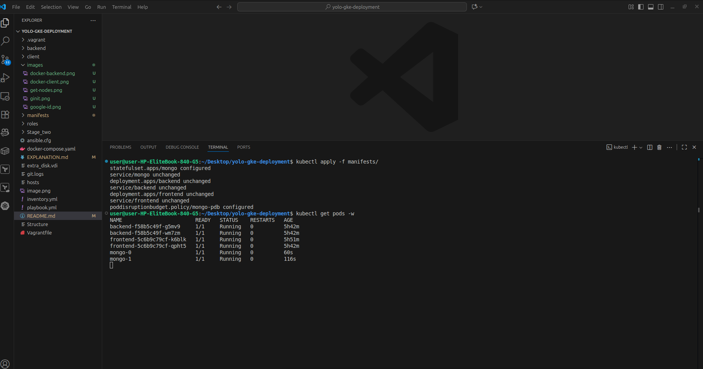
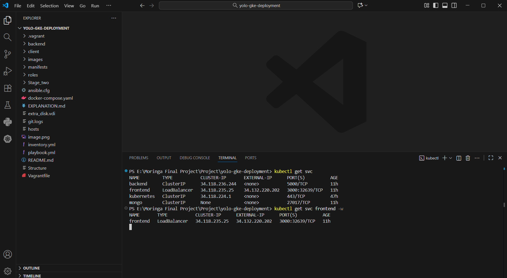

# YOLO E-Commerce App Deployment on GKE

This repo deploys the YOLO app (from https://github.com/Majangajohn/yolo-gke-deployment.git) on Google Kubernetes Engine using custom Docker images.

The deployment includes stateless components (frontend and backend) via Deployments and a stateful database (MongoDB) via StatefulSet, with self-healing, resource management, and persistent storage.

## Prerequisites
- Google Cloud account with billing enabled.
- gcloud CLI installed and authenticated (`gcloud init`).
- kubectl installed.
- Docker installed for building images.
- Docker Hub account for pushing images.
- Docker images pushed: ```docker.io/majangajohn/nyange-yolo-client:v2.1.0``` and `docker.io/majangajohn/nyange-yolo-backend:v2.1.0`.
- MongoDB image: Uses official `mongo:latest`.

## Accessing Google Cloud via CLI

Install gcloud CLI from https://cloud.google.com/sdk/docs/install.
Authenticate: `gcloud init` (follow prompts to log in and select/set a project).
Verify: `gcloud auth list` (shows active account).



## Building and Pushing Docker Images
Build images from the original repo folders and push to Docker Hub for Kubernetes to pull them.

1. **Clone original repo:** git clone `https://github.com/Majangajohn/yolo-gke-deployment.git`.
2. **Build frontend** (from `client/`folder):

```bash
    cd client
    docker build -t yourusername/yolo-frontend:version tag.
    docker login
    docker push yourusername/yolo-frontend:version tag
```
- validate docker login on the browser to ensure succesful login

3. **Build backend (from `backend/`folder):**
```bash
cd ../backend
docker build -t yourusername/yolo-backend:version tag.
docker push yourusername/yolo-backend:version tag
```
- Replace `yourusername` with your Docker Hub username. Use versioned tags for easy identification and rollback.i.e `yolo-frontend:1.0.`



## Step-by-Step Deployment
1. **Create GKE Cluster**:

- Set project: `gcloud config set project your-project-id`. You get project id from google cloud console after you create project
    
-  Create cluster
```bash
    gcloud container clusters create yolo-cluster \
    --zone us-central1-a \
    --num-nodes 2 \
    --enable-autoscaling \
    --min-nodes 2 \
    --max-nodes 4 \
    --machine-type e2-small
  ```
This provisions 2 initial nodes, autoscaling between 2-4 based on load.

Connect kubectl: `gcloud container clusters get-credentials yolo-cluster --zone us-central1-a`.

2. **Listing Created Nodes**
Verify nodes:

```kubectl get nodes```

Output shows node names, status (Ready), and details.



3. **Apply Manifests**:
Manifest files in manifests/ are numbered (e.g., 01-mongo-statefulset.yaml) to indicate application order.
This ensures dependencies (e.g., mongo ready before backend).

```kubectl apply -f manifests/```

Monitors pods: `kubectl get pods -w` (wait for Running status).




4. **Get services and External IP**:
- List services: `kubectl get svc` (shows types, cluster IPs, external IPs).
- Wait for frontend external IP: `kubectl get svc frontend -w` (EXTERNAL-IP changes from <pending> to an IP like 34.123.45.67).

Access app: `http://<EXTERNAL-IP>:3000`



5. **Accessing Live Link and Testing**:
- Open h`ttp://<EXTERNAL-IP>:3000` in browser (replace with actual IP after deployment)..
- Test: View products, add to cart (data persists via MongoDB).

6. **Test Self-Healing**:
Kubernetes controllers recreate pods to maintain replicas=2.

- List pods: `kubectl get pods` (shows 2 each for frontend, backend, mongo).
- Delete a pod: `kubectl delete pod <pod-name>` (e.g., frontend-abc-123).
- Watch: `kubectl get pods -w` (new pod spins up automatically).

[Screenshot Placeholder: Before/after kubectl get pods showing pod deletion and recreation]

7. **Cluster Maintenance** (optional, to avoid costs):
- Set maintenance window: `gcloud container clusters update yolo-cluster --zone us-central1-a --maintenance-window-start=2025-11-07T02:00:00Z --maintenance-window-end=2025-11-07T06:00:00Z --maintenance-window-recurrence=FREQ=WEEKLY;BYDAY=SA,SU.`
- Monitor: Use Google Cloud Console > Kubernetes Engine > yolo-cluster.
- Cleanup: g`cloud container clusters delete yolo-cluster --zone us-central1-a` (to avoid costs).

[Screenshot Placeholder: GKE cluster dashboard in Google Cloud Console showing maintenance settings]

7. **Pod Disruption Budget (PDB) Demonstration**:
PDB prevents simultaneous disruption of too many pods (minAvailable:1 for mongo).

- Try deleting both mongo pods: `kubectl delete pod mongo-0 mongo-1`.

- Kubernetes evicts only one at a time; the second waits until the first recreates.

[Screenshot Placeholder: Attempted deletion of both mongo pods showing only one evicted, with the other pending due to PDB]


## Troubleshooting
- Image pull errors: Ensure images are public on Docker Hub.
- DB connection: Check logs if MONGO_URI fails.
- Persistence: Delete mongo pod; cart data should remain via PVC and replica set.
- Pods not ready: `kubectl describe pod <pod-name>`.
- Logs: `kubectl logs <pod-name>`.
- Resources: `kubectl top pods` for usage.

## How Google Kubernetes Engine (GKE) Works
GKE is Google's managed Kubernetes service. It handles the control plane (free), while you manage worker nodes (paid). Pods (containers) run on nodes; Deployments/StatefulSets manage replicas for scaling/healing. Services route traffic (internal/external). Autoscaling adjusts nodes (min 2, max 4 here) based on CPU/memory. Persistent Volumes ensure data survival. GKE integrates with Google Cloud for load balancing, monitoring, and security.
